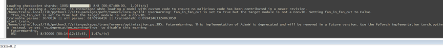
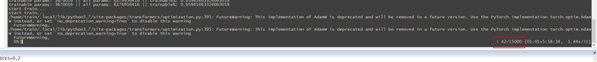
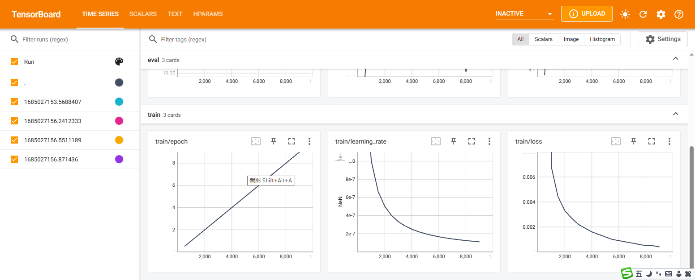

#### 作者也是小白，从零开始部署，微调，都是现学的,有问题的话，请大家多多指正，一起进步。

### 查看此文档，你将学到什么?

+ 1 如何部署运行chatglm-6b
+ 2 如何使用LORA微调chatGLM-6B模型,单卡，多卡均可。

#### 在此感谢
~~~
https://github.com/THUDM/ChatGLM-6B
~~~

#### 更新说明
---
+ 2023-05-25
  - 更新最新的模型文件，修改alpaca_dataset,支持新模型训练。
  - 添加DDP分布式训练代码，目前测试中。
    - 使用DDP分步式训练相同数据集，相同参数，gradient_accumulation_steps=4
    - 单卡训练耗时12小时
    - 
    - 使用DDP两卡并行，耗时6小时,效率提升50%.
    - 
    - tensorboard --logdir /home/train/check_points/runs/May25_16-45-12_localhost.localdomain
    - 

+ 2023-04-21 
    - 重构训练时的参数、生成数据集、张量等一系列操作。
    - 重构代码目录，去掉parallel,自动多卡运行
  
+ 2023-04-08 修改生成测试json逻辑，完成改名操作,如下图所示
  
  

#### 如何部署运行chatglm-6b?

- 1、HF 下载模型配置及权重文件： https://huggingface.co/THUDM/chatglm-6b/tree/main  最新版的在我这里不支持多卡并行训练，仅能单卡训练。
  - 共享一个模型，能够多卡运行,下载后替换model目录下的所有文件 -> [百度网盘](https://pan.baidu.com/s/15O5WSDVqXH0QEjm5DeNeng?pwd=8888)
- 2、安装依赖
  ~~~
  pip3 install protobuf==3.20.0 transformers==4.27.1 icetk cpm_kernels
  ~~~
- 3、修改 chat_interact.py 中的 PRE_TRAINED_MODEL_PATH='上面克隆的chatglm-6b文件夹路径'
- 4、运行代码 python3 chat_interact.py
- 5、生成效果如下：
  回答问题
    - 
      做数学题
    - 
      写标书提纲
    - 
      时政解答
    - 
      翻译
    - 
    - 另外还有许多功能，比如：
        - 自我认知
        - 提纲写作
        - 文案写作
        - 邮件写作助手
        - 信息抽取
        - 角色扮演
        - 评论比较
        - 旅游向导

#### 如何使用LORA微调chatglm-6b,单卡、多卡训练

+ 1 准备数据集，我改造了作者原来的csv数据集，换成了alpaca json格式
+ 2 运行start_train.sh 训练代码,这是单卡训练
+ 
+ 3 多卡训练，至少2张，测试使用2张、4张均可，理论上支持任意张卡。
+ 

#### 文件结构说明

+ chat_interact.py 交互式对话，命令行下运行,一般用于测试机器人对话。
+ chat_server.py 连接数据库，根据数据表对话内容，排队进行回答，并将生成内容回写到表，它依赖我写的数据库连接组件，另外还有一个http服务接收前端请求。
+ start_chat_server.sh 启动chat_server.py
+ data 训练数据集
+ model 官方chatglm-6b模型文件夹,这里面不包含.bin文件，需要将bin复制进来，当然这个目录你也可以放到其它任意位置。
+ finetuning 训练代码目录（支持多卡，在运行训练代码前，先export CUDA_DEVICE_ORDER="PCI_BUS_ID" export CUDA_VISIBLE_DEVICE="0,1,2,3",这里用4张卡 ）
+ ddp 为分布式训练
+ finetune_util 工具类
  ~~~
  训练需要安装如下依赖
  pip3 install datasets peft
  ~~~
+ start_train.sh 单卡训练shell
+ preprocess 生成测试数据代码

#### 环境说明

+ 系统版本：CentOS Linux release 7.9.2009 (Core)
+ 内核版本：3.10.0-1160.el7.x86_64
+ python 版本：3.7.16
+ NVIDIA驱动版本： 515.65.01
+ CUDA 版本：11.7
+ cuDNN 版本：v8.8.0
+ GPU：P40 24gb * 8 